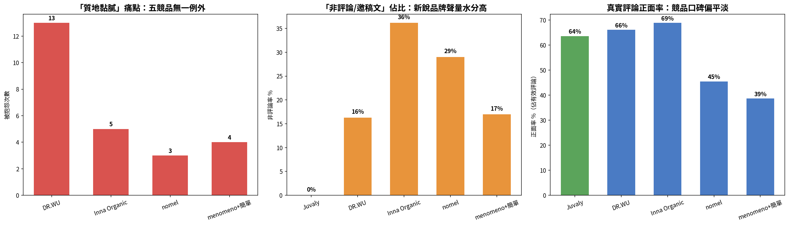

# Juvaly Review Analysis — Sentiment Labelling for a Cosmetics Brand and Five Competitors

A competitor review analysis built for Juvaly, a Taiwanese cosmetics brand. Reviews were
scraped from @cosme Taiwan, cleaned, labelled by a language model against a written codebook,
and aggregated into a sentiment and pain-point comparison across six brands.

Scraping the reviews is not the hard part. Three things took the work. **Deciding what counts
as a review**, because brand pages on @cosme mix real user posts with copied marketing text,
and a sentiment rate computed over both is meaningless. **Making the model label consistently**,
because an unconstrained model calls polite filler positive and reads "not greasy" as a
complaint about greasiness. **Knowing whether the labels are any good**, which is why a human-
labelled validation set gates the batch run rather than following it.

What is here is a seven-stage pipeline, a codebook, 500 labelled reviews across six brands, and
a record of which committed figures can be reproduced from the committed data. **Three of the
five summary rows cannot.**

---

## Demo

*Aggregate output: sentiment distribution and pain-point ranking across the six brands. The
figure was produced from an earlier data snapshot than the one committed here; see
[`docs/known-issues.md`](docs/known-issues.md) C-1.*

---

## What It Does

**Treats marketing copy as a labelling class rather than filtering it upstream.** The codebook
defines 非評論 (not a review) as a fourth sentiment value, so text that turns out to be official
copy is recorded as such instead of silently dropped. Across 500 labelled rows, 111 fall into
this class — 22.2% of everything scraped.

**Gates the batch run on measured agreement.** `groq_validate.py` runs the same labelling
function over a human-labelled set and prints per-case disagreements. The intended threshold was
80% before committing to the full run. Two runs against the committed validation set scored 64%
and 67%, using a replacement model — see [Test Setup and Success Criterion](#test-setup-and-success-criterion).
The threshold was not met.

**Shares one codebook between validation and production.** `_codebook.py` is imported by both
`groq_validate.py` and `groq_label_batch.py`. The standard that was measured is therefore the
same standard that ran, rather than two prompts that drifted apart.

**Encodes the failure modes it actually hit.** The codebook carries four explicit rules, each
written against a misclassification: "not greasy" is a highlight and never a complaint about
texture; polite praise is neutral, not positive; agreeing with a brand's philosophy is not
satisfaction with its product; sponsored posts that reproduce official copy are 非評論.

**Resumes rather than restarts.** The batch labeller checkpoints every ten rows and, on a second
run, reprocesses only rows whose sentiment is missing or marked 錯誤. No row in the committed
data carries 錯誤, so the retry path either never fired or always recovered.

---

## Scope

| Component | Covers |
|---|---|
| `scripts/crawler_brand.py` | Paged scrape of one @cosme brand page, with 503 backoff |
| `scripts/clean_reviews.py` | Shared cleaner: official copy, minimum length, duplicates |
| `scripts/clean_brand.py` | Strips the author block that prefixes brand-page review text |
| `scripts/_codebook.py` | The labelling standard, shared by validation and production |
| `scripts/groq_validate.py` | Agreement check against human labels |
| `scripts/groq_label_batch.py` | Batch labelling, checkpointed and rate-limit aware |
| `scripts/analyze.py` | Cross-brand aggregation and figure |
| `app.py` | Streamlit interface over the labelled data |

8 Python files · 6 labelled datasets · 500 labelled reviews · 6 brands · 4 sentiment classes ·
15 pain-point categories · 10 highlight categories

Row counts come from `pandas.read_csv` rather than line counting, because review text contains
embedded newlines. Category counts are the enumerated options in `_codebook.py`, including 其他.

Developed 2026.

---

## Test Setup and Success Criterion

The original 500-row labelling ran against `llama-3.3-70b-versatile` through the Groq API at
temperature 0 with a JSON response format. That model was decommissioned by Groq on 2026-08-16
(see [`docs/known-issues.md`](docs/known-issues.md) C-6) and cannot be queried again — the
committed labelled data is unaffected, but it can never be re-validated against the model that
actually produced it.

The success criterion was agreement with human labels on a held-out set, at 80% or better on
sentiment before the batch run proceeded. **Evaluated, with a caveat.** Two runs against the
33-row validation set with `openai/gpt-oss-120b`, the replacement model, scored 64% and 67% —
below the threshold. This measures the replacement model's raw, uncorrected performance, not the
originally-delivered labelling, which was corrected through manual review before delivery (see
`docs/juvaly_report.pdf`). Errors cluster on neutral-sentiment reviews being confused with
non-review or positive; see C-1 in known-issues for the full breakdown.

Pain points and highlights were never validated against human labels at all. Only sentiment was.

---

## Measurement Basis

| Measurement | Value | Nature |
|---|---|---|
| Labelled reviews, all brands | 500 | Observed, committed data |
| Classed 非評論 | 111 (22.2%) | Observed |
| Classed 錯誤 | 0 | Observed |
| Valid reviews after excluding 非評論 | 389 | Derived |
| Brands | 6 | Test parameter |
| Sentiment agreement with human labels | 64–67% (two runs) | Measured, below 80% threshold, replacement model |
| Pain-point labelling accuracy | not measured | Never validated |
| Highlight labelling accuracy | not measured | Never validated |
| Reviews discarded during cleaning | not recorded | Raw data absent |
| Inter-run labelling stability | 91% (30/33) identical | Measured, two runs |

Three qualifications govern how the table should be read.

**Positive rate is not brand sentiment.** @cosme is a review platform whose posting population
skews towards users motivated enough to write. A 66% positive rate describes the reviews that
exist on that platform for that brand, not the opinion of its customers.

**Juvaly's own sample is too small to compare.** Nine valid reviews against 123 for DR.WU. Any
rate computed over nine rows moves by 11 points per row, so the client's own column in the
comparison is not on the same footing as the competitor columns.

**The 非評論 rate is a property of the brand page, not the brand.** Inna Organic's 36.2% is the
highest in the set, which says its brand page carries proportionally more copied marketing text.
It says nothing about the product.

---

## Problem Statement

A brand wants to know what reviewers complain about, in its own reviews and in its competitors'.
The obvious approach is to scrape the reviews and run sentiment analysis over them.

That fails twice. First, brand pages are not review corpora: they interleave user posts with
product descriptions and sponsored text that reproduces official copy, and any rate computed
over the mixture is a rate over an unknown denominator. Second, an off-the-shelf sentiment model
returns a polarity but not a reason, and a brand cannot act on polarity. What it can act on is
"reviewers who dislike this say it is greasy" — which requires a labelling scheme somebody has
to define, and a way to check that the labels follow it.

The problem this repository addresses is therefore: define a labelling standard for a specific
product category, and establish whether a language model applies it consistently enough to use.

---

## Shared Pipeline and Data Flow

There is no service and no deployment target. Seven scripts run in sequence, each reading the
previous one's output from disk.

crawler_brand.py @cosme brand page, paged, 3s between requests
│ 503 -> sleep 10s x attempt, up to 4 attempts
▼
clean_reviews.py drop official copy, drop under 100 chars, drop duplicates
clean_brand.py strip the author block, drop under 50 chars, renumber
▼
groq_validate.py label a human-labelled set, print disagreements
│ gate: proceed only above 80% sentiment agreement
▼
groq_label_batch.py label every row, checkpoint every 10, resume on 錯誤
▼
analyze.py aggregate across brands, write summary and figure

The split exists because each stage is slow and fails differently: scraping is rate-limited by
the site, labelling is rate-limited by the API, and both take long enough that restarting from
the beginning is expensive. Writing to disk between stages makes each one independently
resumable.

The accepted cost is that nothing enforces stage order or input freshness. A stale intermediate
file is read exactly like a fresh one, which is how the committed summary came to disagree with
the committed data, and how a stale validation result was committed once before being replaced
with a real one.

---

## Design

### One codebook, imported rather than copied

The validation script and the batch labeller need the same labelling standard. Writing the
prompt into both would allow them to drift, and a drift would be silent: validation would measure
one standard while production applied another. `_codebook.py` holds the prompt as a single
constant and both scripts import it.

The accepted cost is that changing the codebook invalidates any previous validation result. The
repository does not record which codebook version any measurement was taken under.

### Validation precedes the batch, because the batch is the expensive part

Labelling 500 rows at two seconds apart is roughly 17 minutes of API time, and a labelling error
found afterwards means relabelling all of it. `groq_validate.py` runs first over a human-labelled
set, prints every disagreement with the human label, the model label, and the first 35 characters
of the text, and the batch proceeds only if agreement clears 80%.

The accepted cost is that the validation set had to be labelled by hand, and that only sentiment
was checked. Pain points and highlights went to production unvalidated. When this gate was
finally run, it did not clear 80% — see Test Setup and Success Criterion.

### The codebook states the traps, not just the categories

A category list alone produces predictable errors. "不黏膩" contains 黏膩 and gets labelled as a
texture complaint. Polite closing remarks get read as praise. Agreement with a brand's
sustainability stance gets read as product satisfaction. Each of these became an explicit rule
in the codebook, written as a prohibition rather than a definition.

The accepted cost is that the codebook is specific to cosmetics reviews in Traditional Chinese
and does not transfer.

### Marketing copy is labelled, not filtered

`clean_reviews.py` removes text that begins with 商品說明 or matches two or more advertising
signals, but the filter is deliberately conservative and the codebook keeps 非評論 as a label the
model can assign. Anything the cleaner missed is therefore counted rather than quietly folded
into the sentiment denominator.

The accepted cost is one extra class the model can get wrong, and a 非評論 rate that varies from
12.7% to 36.2% across brands with no way to tell mislabelling from genuine variation in how each
brand page is written.

---

## Evaluation

Sentiment distribution over the committed data, computed with `pandas`:

| Brand | Total | 非評論 | Valid | 正面 | 中性 | 負面 | Positive rate |
|---|---|---|---|---|---|---|---|
| DR.WU | 147 | 24 | 123 | 81 | 39 | 3 | 65.9% |
| Inna Organic | 141 | 51 | 90 | 62 | 23 | 5 | 68.9% |
| 綠藤 | 110 | 14 | 96 | 61 | 29 | 6 | 63.5% |
| menomeno + 簡單 | 58 | 9 | 49 | 18 | 27 | 4 | 36.7% |
| nomel | 31 | 9 | 22 | 10 | 11 | 1 | 45.5% |
| Juvaly | 13 | 4 | 9 | 9 | 0 | 0 | 100% |
| **All** | **500** | **111** | **389** | **241** | **129** | **19** | **62.0%** |

**These figures are not the ones in the committed summary.** `outputs/competitor_summary_final.csv`
reports 118 valid for DR.WU against 123 here, 44 for menomeno against 49, and 33 for Juvaly
against 9. Two rows, Inna Organic and nomel, do agree. 綠藤 is absent from the summary entirely
although its data is committed. The summary was produced from a different snapshot, and that
snapshot is not in this repository. See known-issues C-1 through C-4.

**Negative labels are rare everywhere.** Nineteen negative labels across 389 valid reviews is
4.9%. The validation run offers a partial explanation rather than a full one: of 33 validation
rows, only one was human-labelled 負面, and the model missed it — assigning 中性, not 正面. A
single case cannot establish whether the codebook's negative definition is too narrow or the
model under-applies it, but it does confirm the negative class is too sparse in a 33-row set to
say much about itself, which is exactly the problem raised in Open Problems below.

**The pain-point analysis did not run.** `analyze.py` defines `normalize_pain()` to collapse the
free-text pain-point column into six buckets, but `main()` never calls it. The pain-point ranking
described in the report was therefore produced by some other means.

---

## Threats to Validity

**Construct validity.** Positive rate is measured over reviews that exist on one platform. It is
being used as a proxy for brand sentiment, which is a different quantity with a different
population.

**Internal validity.** The committed summary and the committed data disagree for three of six
brands. Any conclusion drawn from the summary is therefore attributable either to the analysis or
to the snapshot difference, and this repository cannot separate them.

**Instrumentation.** Sentiment labelling accuracy was checked against a committed validation set
and did not clear this project's own 80% bar (64–67%, see Evaluation). It was also checked against
a replacement model, not the one that produced the committed data, because the original was
decommissioned mid-project. Pain points and highlights — the two columns the client actually
asked for — were never checked against a human standard at all.

**External validity.** Six brands from one category on one platform in one language. The codebook
names cosmetics-specific categories and cannot be applied elsewhere without rewriting.

**Configuration.** Every script has its input path hardcoded as a module-level constant with a
comment saying to edit it per brand. Running the pipeline on a second brand without editing every
constant produces output under the previous brand's filename, and nothing detects this.

**Vendor dependency.** The labelling model was retired by its provider partway through this
project, with roughly two months' notice. The committed data survives that (it was produced
before decommission), but the validation and any future labelling now runs on a different model
with measured different behaviour, and no mechanism here would catch it happening again.

---

## Open Problems

**How large does a validation set need to be for a codebook of this shape?** Sentiment has four
classes and one of them, 負面, appears in 4.9% of the data. A 33-row validation set drawn without
stratifying on sentiment contained exactly one 負面 case — the model missed it. That is not
enough to say anything about the negative class specifically, which is the class a brand most
needs labelled correctly. Stratifying the validation set requires knowing the distribution first,
which requires labelling first.

**Can multi-label columns be validated the same way as single-label ones?** Sentiment agreement
is a straightforward match. Pain points are a semicolon-separated subset of fifteen categories,
so two labels can be partly right, and no threshold was ever defined for what partly right means.
This is why those two columns went unvalidated rather than validated badly.

**What is the denominator?** The 非評論 rate varies by a factor of nearly three across brands.
Whether that reflects the brands' marketing behaviour or the model's inconsistency determines
whether cross-brand comparison is valid at all, and the data here cannot answer it.

**What happens when the underlying model changes?** It already did, mid-project, with no
mechanism in this repository to detect it beyond every API call failing at once. A pipeline that
depends on a named third-party model with no version pin, no pre-flight check, and no
configurability has an unaddressed single point of failure.

The pipeline ran on one machine against free-tier API limits, which set the two-second inter-row
delay and the 500-row total. A larger corpus would change what can be asked, not just how
precisely it can be answered.

---

## Repository Layout

README.md
app.py Streamlit interface over the labelled data
requirements.txt
requirements_scripts.txt scraping, cleaning, and labelling script dependencies
.env.example GROQ_API_KEY only
scripts/
crawler_brand.py @cosme paged scrape, 503 backoff, 3s delay
clean_reviews.py shared cleaner: official copy, length, duplicates
clean_brand.py strips author block, 50-char floor, renumbers
_codebook.py the labelling standard, imported by two callers
groq_validate.py agreement check, writes result to outputs/, not just stdout
groq_label_batch.py batch labelling, 10-row checkpoint, 錯誤 resume
analyze.py cross-brand aggregation and figure
data/labeled/ 6 brand CSVs (500 rows, 8 columns) + validation_set.csv (33 rows, 6 columns)
outputs/
final_competitor_analysis.png produced from an earlier snapshot
competitor_summary_final.csv disagrees with data/labeled for 3 of 6 brands
validation_result.json latest B-1/B-3 run
validation_result_run1.json first of two runs, kept for stability comparison
docs/
architecture.md
metrics.md
known-issues.md
Juvaly_Executive_Summary.docx client deliverable
menomeno_jandan.xlsx working file

---

## Tech Stack

**Scraping**  Python · requests · BeautifulSoup

**Labelling**  Groq API · originally `llama-3.3-70b-versatile`, decommissioned 2026-08-16 ·
now `openai/gpt-oss-120b` · temperature 0 · JSON response format

**Analysis**  pandas · matplotlib

**Interface**  Streamlit

---

## Running Locally

pip install -r requirements.txt
pip install -r requirements_scripts.txt
cp .env.example .env # then set GROQ_API_KEY
cd scripts
python crawler_brand.py # edit BRAND_ID and BRAND_NAME first
python groq_validate.py # gate: prints and writes ../outputs/validation_result.json
python groq_label_batch.py # edit INPUT_FILE and OUTPUT_FILE first
python analyze.py
streamlit run ../app.py

Two things look like they will work and will not. `data/raw/` does not exist in this repository,
so the crawler writes to a path that must be created first and the cleaning scripts have no input
until it has run. `analyze.py` reads `data/labeled/labeled_reviews.csv` for the Juvaly row, which
is absent, so the script fails on its first file rather than producing a partial result — see C-2.

`groq_validate.py` now runs end to end; its validation set is committed and its result is written
to `outputs/validation_result.json` rather than only printed.

---

## Author

Stephanie (Yen-Yu) Lin
Industrial Engineering and Engineering Management, National Tsing Hua University

Built for Juvaly as an independent review-analysis project. Review text is reproduced from
public @cosme Taiwan brand pages; no reviewer identifiers were collected or stored.
